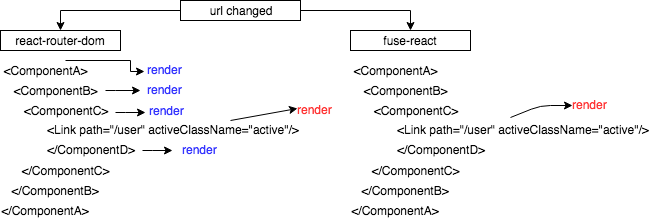

# fuse-react

`fuse-react` is an abtraction on top of React Component which relieves the pain for those who find Redux overly complicated.
`fuse-react` offers a solution to react routing which is more flexible and memory efficient than `react-router-dom`

## Router

`fuse-react` Router does everything (and does NOT) that `react-router` does

- Memory efficient (render only required component)
- Component lazy load
- Extended Link support (aka mini router) with custom tags
- No wrapping the application
- Nothing else is required but `Switch` and `Route` (works with any React.Component framework)



```tsx
<Switch>
  <Route path="/user" component={async () => import("./UserRoute")} />
</Switch>
```

FuseReact Router is very similar to `react-router`, in fact it mimics the API so the transition will be as smooth as possible.

Unlike `react-router` `fuse-react router` subscribes to changes and renders only necessary components avoiding `render` from the top of the DOM tree.

### Switch and Route

To create a router swith do the following

```tsx
import * as React from "react";
import { Switch, Route } from "fuse-react";

export class UserRoute extends React.Component {
  public render() {
    return (
      <Switch>
        <Route path="/user" component={async () => import("./UserRoute")} />
        <Route match="/group">Group route</Route>
      </Switch>
    );
  }
}
```

`Switch` object doesn't need to have any parent object unlike `react-router`, it can be placed anywhere.

Matching `/user/anything/here`

```tsx
<Route path="/user" component={UserRoute} />
```

Strict match `/user`

```tsx
<Route path="/user" exact component={UserRoute} />
```

Render children

```tsx
<Route path="/user">I will be rendered</Route>
```

Access `route` object via props in your component

```tsx
import * as React from "react";
import { Switch, Route } from "fuse-react";

export class UserRoute extends React.Component {
  init() {}
  public render() {
    return <div>User Id: {this.props.match.params.id}</div>;
  }
}
```

## Router object instantiation

### Via children (simplest)

Match params are not supported here

```tsx
<Route path="/user">I will be rendered</Route>
```

### Component property as React.Element prototype

This one is the most popular with `react-router-dom`

```tsx
<Route path="/user" component={UserRouter} />
```

### Component property as a function (returns React.Element prototype)

```tsx
<Route path="/user" component={match => UserRouter} />
```

### Component property as a function (returns React.Element)

```tsx
<Route path="/user" component={match => <UserRouter {...match} />} />
```

### Component property as an async function (lazy load)

Once `UserRouter` is lazy loaded, we will try to find `default` or the first exports key as a valid React.Component
and apply `match` as a property

```tsx
<Route path="/user" component={async match => import("./UserRoute")} />
```

Another example with timeout

```tsx
<Switch placeholder={<div>Loading</div>}>
  <Route
    path="/listing/a"
    component={() => {
      return new Promise((resolve, reject) => {
        setTimeout(() => {
          return resolve(ListingA);
        }, 1000);
      });
    }}
  />
  <Route path="/listing/b" component={() => ListingB} />
</Switch>
```

## Switch Configuration

Instead of passing `Route` object it's possible to create a configuration file and pass it to `Switch`

```tsx
const config = {
  routes: {
    "/user": {
      component: UserRoute
    },
    "/group": {
      component: async () => import("./UserGroup")
    }
  }
};
class MyRootComponent extends React.Component {
  public render() {
    return <Switch config={config} />;
  }
}
```

### Links

The `Link` object is way more flexible comparing to `react-router`'s

Importing

```ts
import { Link } from "fuse-react";
```

Regular `a` tags

```tsx
<Link activeClassName="active" to="/user/listing">
  list
</Link>
```

Custom render

`render` property accepts `active` and `navigate` function

```tsx
<Link
  to="/user/add"
  render={(active, navigate) => (
    <div className={active ? "active" : ""} onClick={navigate}>
      To user
    </div>
  )}
/>
```

Custom render converts your link into a mini router. You can pass additional property for matching

```tsx
<Link
  to="/user/add"
  match="/user"
  render={(active, navigate) => (
    <div className={active ? "active" : ""} onClick={navigate}>
      To user
    </div>
  )}
/>
```

In the case above `active` is `true` when navigated to `/user/foobar`, however the `navigate` function navigates to `/user/add`

### Navigation

Access navigation from anywhere in your code!

```ts
import { navigate, mergeQuery, setQuery } from "fuse-react";
```

Navigating to path

```ts
navigate("/user");
```

Passing and overriding query arguments

```ts
navigate("/user", { foo: "bar" });
// will result in `/user?foo=bar`
```

Setting query

```ts
setQuery({ foo: "bar" });
// will result in `/current-url?foo=bar`
```

Merging query

```ts
// existing url "/user?hello=world"
mergQuery({ foo: "bar" });
// will result in `/user?hello=world&foo=bar`
```

Additionally `setQuery` and `mergQuery` accept a second bool argument. Dispatch (update trigger for all `Switch` and `Link` on scene) won't be triggered when set `false`

```ts
// existing url "/user?hello=world"
mergQuery({ foo: "bar" }, false);
// will result in `/user?hello=world&foo=bar`
```

A component can "connect" to an individual key in the store and react to its changes.

The framework also offers a router which has some improvements comparing to `react-router`

```tsx
@connect("count")
class MyUser extends Fusion<any, any, MyStore> {
  public render() {
    return <div>{this.store.count}</div>;
  }
}
```

The decorator `@connect` registers subscription to the store, therefore once we update the object it will be forced to get updated.

```ts
dispatch("count", 1); // like this
dispatch({ count: 1 }); // or like this
```

## Create your store

```ts
import { createStore } from "fuse-react";
class MyStore {
  count = 0;
}
createStore(MyStore);
```

A class will be instantiated and registered globally

## Connecting

A component can be connected to individual keys in the store

```tsx
import { connect } from "fuse-react";
@connect(
  "count",
  "user"
)
class MyUser extends Fusion<any, any, MyStore> {
  public render() {
    return <div>{this.store.count}</div>;
  }
}
```

The third (optional) generic typing will help with your typings on `this.store`, meanwhile the first and the second arguments remain conventional(IProps, IState)

### Connecting with deep compare

There are situations where you would like to avoid unnesserary updates. For that preffix your key with `@`

```ts
import { connect } from "fuse-react";
@connect("@user")
class MyUser extends Fusion<any, any, MyStore> {
  public render() {
    return <div>{this.store.user.name}</div>;
  }
}
```

Once the dispatcher recieves an event and goes through all subscriptions it will check if the new value is different from the one in the store.

### Init

```tsx
@connect(
  "count",
  "user"
)
class MyUser extends Fusion<any, any, MyStore> {
  private init() {}
  public render() {
    return <div>{this.store.count}</div>;
  }
}
```

It's important to understand the `init` of the component, it will be triggered on `componentWillMount` and `componentWillReceiveProps` as well as when a subscription key in the store has been changed.

Avoid dispatching events from `init` as it might cause an infinite loop.

### Dispatch

```tsx
import { dispatch } from "fuse-react";
dispatch("count", 1); // like this
dispatch({ count: 1 }); // or like this
```
